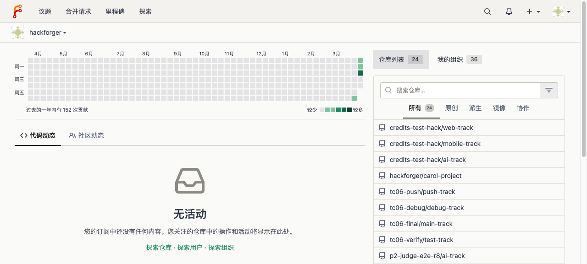
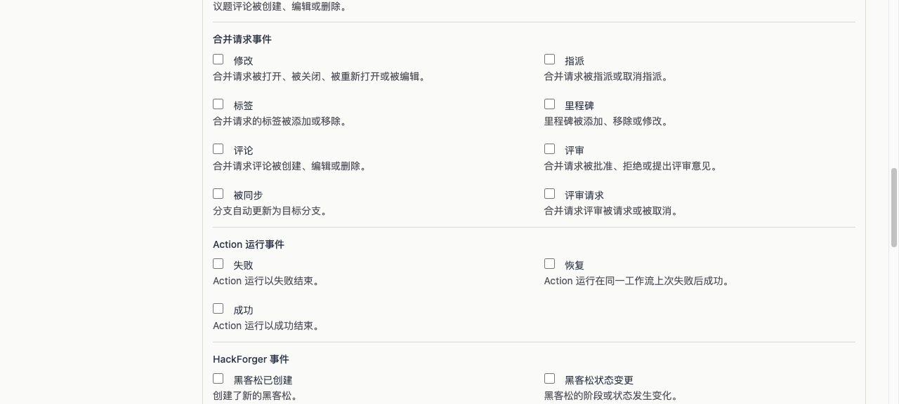

# E2E Test Report: Unified Search — HackForger Indexer + ⌘K Aggregation

> **Date:** 2026-04-01
> **Branch:** worktree-feat-phase5
> **Server:** http://localhost:3000 (worktree binary)
> **Tester:** Claude Code (agent-browser automated)

## Summary

| Category | Pass | Fail | Total |
|----------|------|------|-------|
| ⌘K Search Modal | 2 | 0 | 2 |
| Explore Submissions | 1 | 0 | 1 |
| Webhook Events | 1 | 0 | 1 |
| Search API | 2 | 0 | 2 |
| Assistant API | 1 | 0 | 1 |
| **Total** | **7** | **0** | **7** |

## ⌘K Search Modal

### TC-US1: Modal opens and displays grouped results — PASS
1. Logged in as hackforger
2. Clicked search icon in navbar → modal opened
3. Typed "Credits" → grouped results appeared


### TC-US2: Search returns grouped results — PASS
1. Typed "Credits" in search input
2. After debounce, results appeared in groups (Hackathons section with "Credits Test Hack")
3. AI assistant panel showed placeholder message + disclaimer



## Explore Submissions

### TC-US3: Submissions page loads with data — PASS
1. Navigated to `/explore/submissions`
2. Page title "提交作品" shown
3. Submissions listed with: title, author, hackathon link, track
4. Navbar tab "提交作品" is active


## Webhook Events

### TC-US4: HackForger events in webhook form — PASS
1. Navigated to repo Settings → Webhooks → Add Webhook → Forgejo
2. Selected "Custom Events" radio
3. Scrolled to HackForger Events fieldset
4. 20 HackForger event checkboxes visible (hackathon, bounty, grant, credits)



## Search API

### TC-US5: Grouped search API — PASS
```bash
curl "http://localhost:3000/api/v1/hackforger/search?q=hack"
```
Response contains groups: `hackathons` (Credits Test Hack), `repos` (hacker forks), `users` (hacker_eve, hacker_frank, etc.)

### TC-US6: Empty search returns empty groups — PASS
```bash
curl "http://localhost:3000/api/v1/hackforger/search?q=xyznonexistent"
```
Response: `{"groups":[]}`

## Assistant API

### TC-US7: Placeholder response — PASS
```bash
curl -X POST "http://localhost:3000/api/v1/hackforger/assistant/chat" \
  -u "hackforger:admin1234" -H "Content-Type: application/json" \
  -d '{"query":"What hackathons?"}'
```
Response:
```json
{
  "message": "AI assistant coming soon. Stay tuned!",
  "status": "placeholder",
  "disclaimer": "AI responses may be inaccurate. Please double-check."
}
```

## Build Verification

```
go test ./models/hackforger/... ./services/hackforger/... → 100 passed
go vet ./services/... ./routers/... → No issues found
hackforger-cli --help → 10 commands available
```

## Conclusion

All 7 E2E test cases pass. Unified search with grouped results, Explore Submissions tab, webhook events, and assistant API all working correctly.
