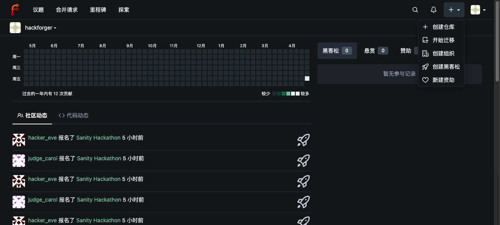
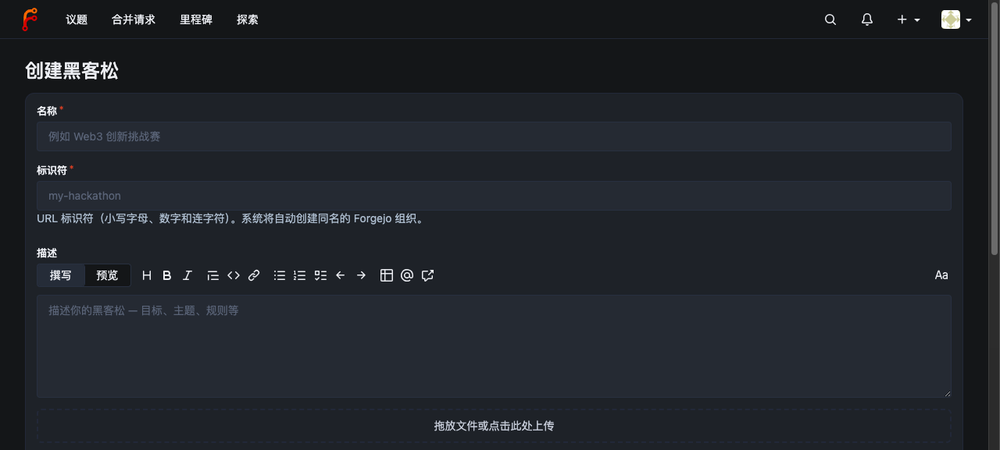
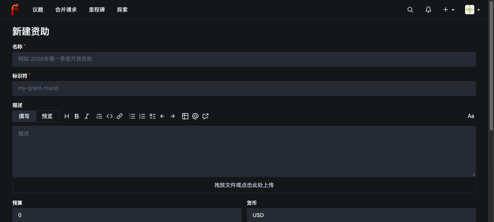
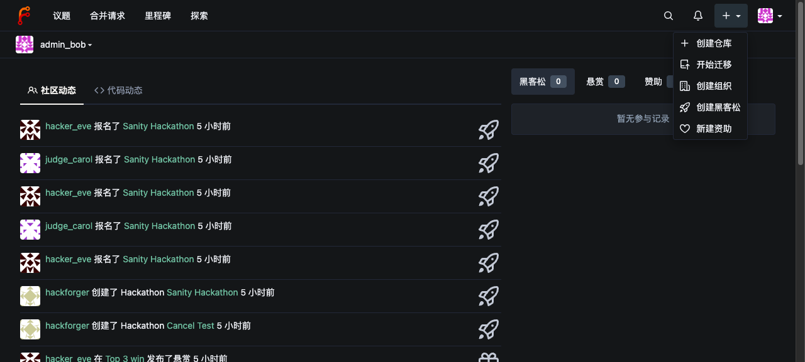
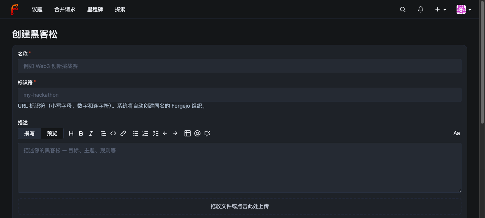
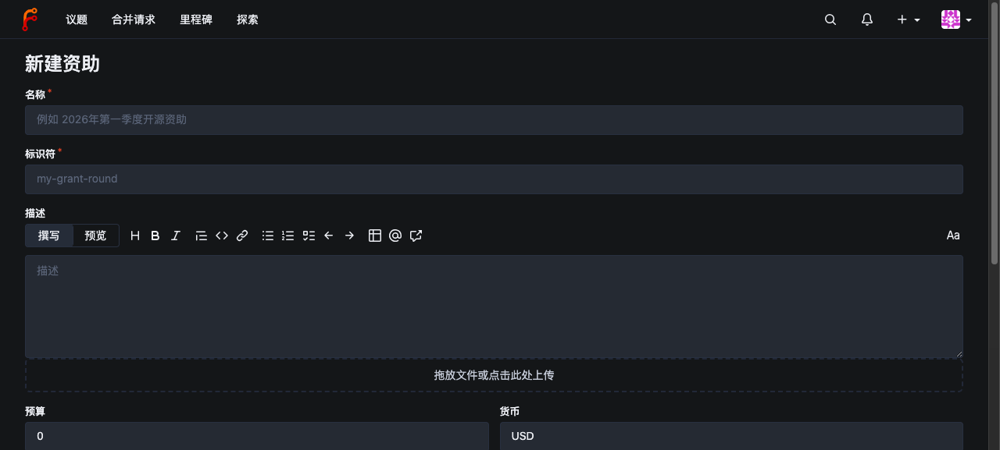
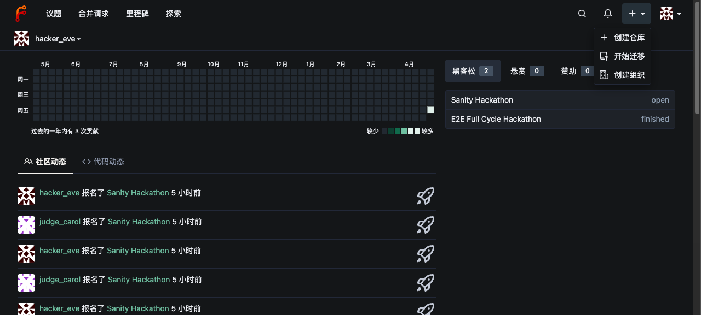

# Issue #118 — Admin-Only Hackathon/Grant Creation E2E

## Goal

Verify that **only site admins** may create hackathons and grant rounds:
- UI: "+" dropdown hides "新建黑客松" / "新建资助" entries for non-admins
- Web routes (`/hackathons/new`, `/grants/new`): return 403 for non-admins
- API routes (`POST /api/v1/hackforger/hackathons`, `POST /api/v1/hackforger/grant-rounds`): return 403 for non-admins
- All gates pass for admin users (verified with **two** separate admin accounts)

## Test environment

- Instance: HackForger TEST (`http://localhost:3001`, PG `hackforger_test` DB)
- Build: includes commits from PR fixing #118

## Test users

| Role | Username | Password env / value |
|---|---|---|
| admin1 | `hackforger` | `$HACKFORGER_TEST_ADMIN_PASSWORD` (in `.env`) |
| admin2 | `admin_bob` | `Test118AdminPass!` |
| non-admin | `hacker_eve` | `Test118NormalPass!` |

## Setup

```bash
# Test instance must be running on :3001 with new build
bash scripts/restart-gitea-test.sh

# Create admin2 if not present
./gitea --config /tmp/hackforger-test-custom/conf/app.ini --work-path /tmp/hackforger-test-data \
  admin user create --username admin_bob --email admin_bob@h2os.cloud \
  --password Test118AdminPass! --admin --must-change-password=false

# Reset hacker_eve password to known value
./gitea --config /tmp/hackforger-test-custom/conf/app.ini --work-path /tmp/hackforger-test-data \
  admin user change-password --username hacker_eve --password Test118NormalPass! --must-change-password=false
```

## Scenarios

### Scenario 1 — admin1 (hackforger) full access

1. Login as `hackforger` at `http://localhost:3001/user/login`
2. Click "+" dropdown in navbar → expect to see **"创建黑客松"** and **"新建资助"** entries
   
3. Navigate to `/hackathons/new` → form renders, HTTP 200
   
4. Navigate to `/grants/new` → form renders, HTTP 200
   
5. `POST /api/v1/hackforger/hackathons` with basic auth → HTTP 201

### Scenario 2 — admin2 (admin_bob) full access

1. Logout, login as `admin_bob`
2. Click "+" dropdown → both entries visible
   
3. `/hackathons/new` → 200
   
4. `/grants/new` → 200
   
5. `POST /api/v1/hackforger/hackathons` → HTTP 201

**Why test 2 admins:** confirms guard checks `IsAdmin` (any admin), not just user id 1.

### Scenario 3 — non-admin (hacker_eve) fully blocked

1. Logout, login as `hacker_eve`
2. Click "+" dropdown → expect only `创建仓库`/`开始迁移`/`创建组织`. **NO** `创建黑客松`, **NO** `新建资助`
   
3. Direct URL `/hackathons/new` → HTTP **403 Forbidden**
   
4. Direct URL `/grants/new` → HTTP **403 Forbidden**
   
5. `POST /api/v1/hackforger/hackathons` → HTTP 403, body `{"message":"only site administrators may create hackathons", ...}`
6. `POST /api/v1/hackforger/grant-rounds` → HTTP 403, body `{"message":"only site administrators may create grant rounds", ...}`

## Defense layers verified

| Layer | File | Behavior verified |
|---|---|---|
| Nav UI | `templates/base/head_navbar.tmpl` | `{{if .SignedUser.IsAdmin}}` wraps both `<li>` |
| Web route middleware | `routers/web/web.go` | `/hackathons/new` + `/grants/new` lifted into separate `m.Group("", ..., reqAdmin)` block |
| Web handler defense-in-depth | `routers/web/hackforger/hackathon.go`, `grants.go` | `if !ctx.Doer.IsAdmin { ctx.NotFound; return }` at handler entry |
| API handler | `routers/api/v1/hackforger/hackathon.go`, `grants.go` | `if !ctx.Doer.IsAdmin { ctx.Error(403, ...); return }` at handler entry |

## Results

All 3 scenarios pass on test instance commit `<merge SHA after PR>`.

## Future work

Issue body mentions a future "二级管理员" / operator role. When introduced:
- Replace `if !ctx.Doer.IsAdmin` with `if !ctx.Doer.IsAdmin && !ctx.Doer.HasOperatorRole`
- Add admin UI to grant the role
- Re-run this E2E (still must pass) + add operator-role scenario
